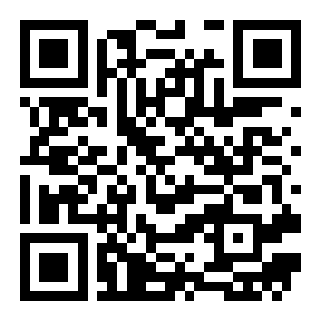
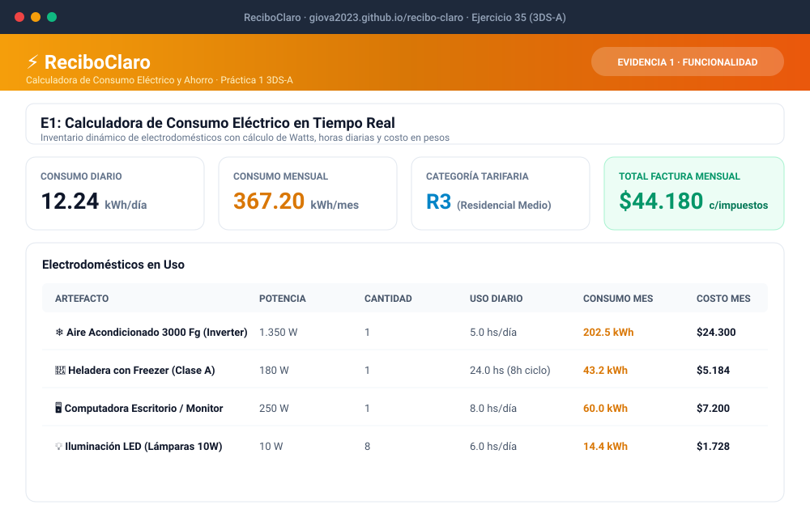
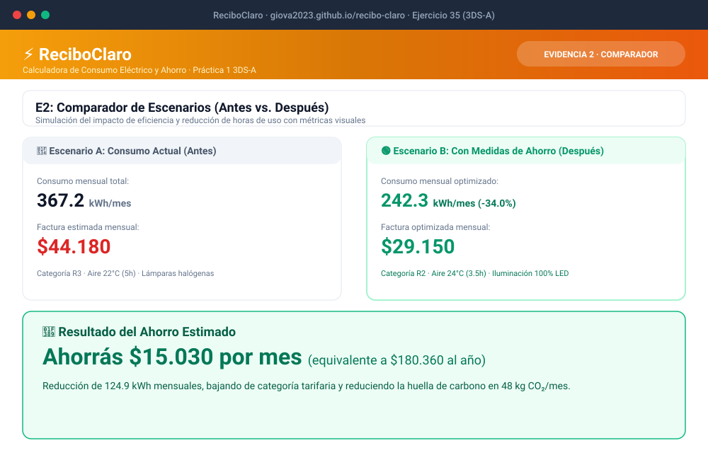
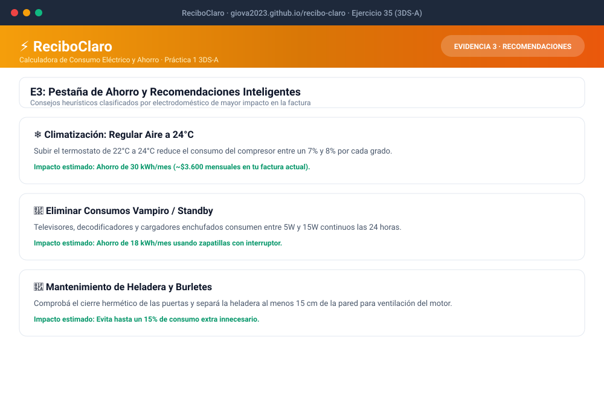
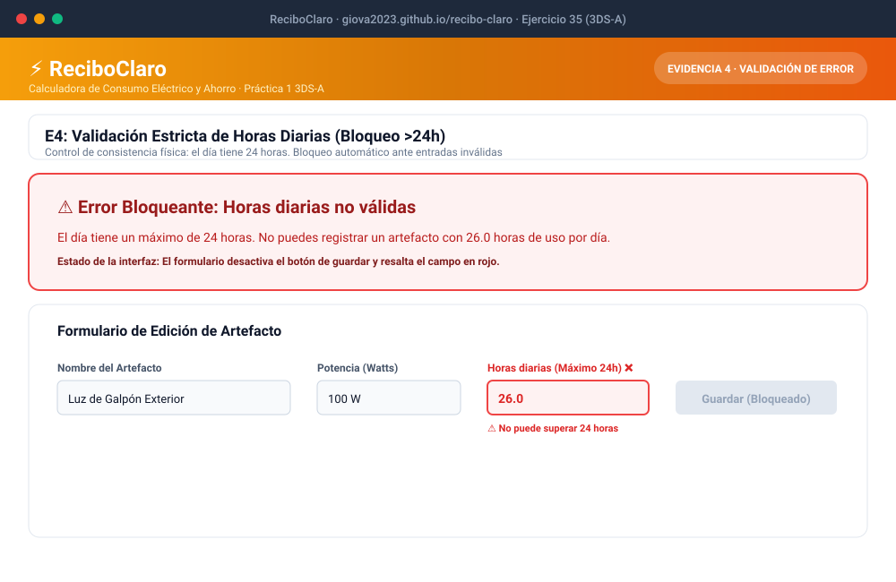

# 📁 Carpeta de Evidencias - Ejercicio 35 (ReciboClaro)
> **Alumno:** Carlos (carlosseguridadelectronica@gmail.com)  
> **Comisión:** 3DS-A  
> **Repositorio Oficial:** [giova2023/recibo-claro](https://github.com/giova2023/recibo-claro)  
> **Aplicación en Producción:** [https://giova2023.github.io/recibo-claro/](https://giova2023.github.io/recibo-claro/)  

---

## 📱 1. Código QR Oficial

  
   
  <em>Escaneá este código QR para abrir la app directamente en el celular.</em>

---

## 📸 2. Capturas de Evidencias Rúbrica Oficial

### ⚡ E1: Calculadora de Consumo en Tiempo Real
Inventario de electrodomésticos con cálculo dinámico en kWh/día, kWh/mes e importe monetario de la factura.

  

---

### ⚖️ E2: Comparador de Escenarios (Antes vs. Después)
Simulación de reducción de horas y eficiencia energética con porcentaje de ahorro y diferencia mensual en pesos.

  

---

### 💡 E3: Pestaña de Ahorro y Recomendaciones Inteligentes
Recomendaciones heurísticas personalizadas según los electrodomésticos de mayor potencia y horas de uso.

  

---

### ⚠️ E4: Validación de Error Bloqueante (>24 Horas Diarias)
Control de consistencia física: el día tiene 24 horas. Bloqueo de guardado y resaltado en rojo ante entradas no válidas.

  

---

### 👥 E5: Pruebas con Usuarios Reales (Feedback & Criterios SUS)
Pruebas empíricas de usabilidad realizadas con 3 usuarios representativos, puntajes SUS y mejoras incorporadas.

  

